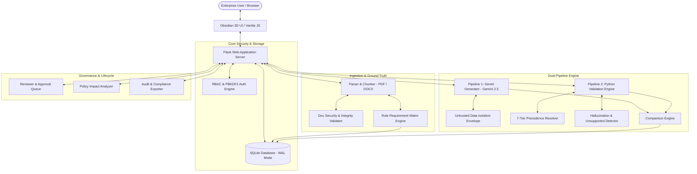
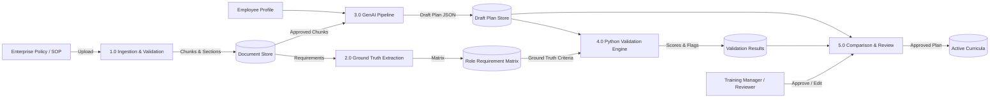
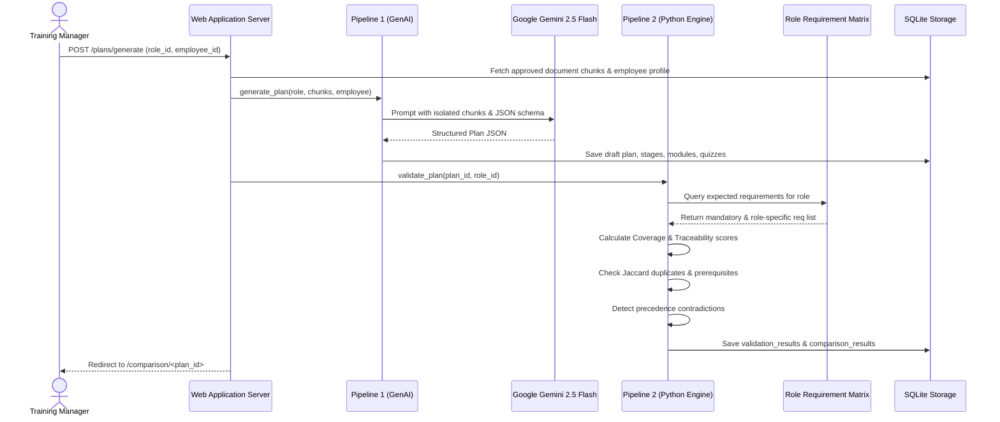

# SkillSprint AI — Comprehensive Project Report (SRS v1.0)
**Theme:** OnboardVerse | **Category:** Generative AI PowerPlay  
**Target Enterprise:** AeroPulse Avionics & Autonomous Systems Inc.  
**System Version:** 1.0.0-PROD | **Date:** September 2026

---

## 1. Executive Summary & Problem Definition

### 1.1 The Enterprise Onboarding Crisis
In mission-critical, regulated industries—such as aerospace avionics, autonomous flight systems, defense, and healthcare—employee onboarding is plagued by severe operational bottlenecks:
1. **Information Fragmentation:** Critical operational procedures, regulatory standards (DO-178C, DO-254, ARP4754A), and cybersecurity protocols are scattered across dozens of disjointed PDF manuals, Word documents, departmental wikis, and historical memos.
2. **Generic, One-Size-Fits-All Programs:** New hires endure weeks of generalized orientation that fails to address role-specific competencies, prerequisite knowledge sequences, or safety-critical toolchains.
3. **Policy Drift & Conflicting Standards:** Overlapping document versions (e.g., an outdated 2021 SOP conflicting with an active 2024 Airworthiness Directive) lead to compliance violations and dangerous operational ambiguities.
4. **The Unchecked LLM Risk:** Attempting to solve this with standard conversational GenAI chatbots introduces catastrophic risks: subtle hallucinations, fabricated safety thresholds, inability to trace assertions to source paragraphs, and vulnerability to indirect prompt injections embedded in uploaded manuals.

### 1.2 The Proposed Solution: SkillSprint AI
SkillSprint AI solves this crisis by introducing a **Dual-Pipeline Architecture** that unites the linguistic synthesis power of modern Large Language Models with the uncompromising mathematical rigor of a deterministic Python validation engine:
- **Pipeline 1 (GenAI Generation):** Grounded exclusively in verified, chunked enterprise documentation, Gemini 2.5 Flash synthesizes personalized, role-specific onboarding curricula structured as strict RFC 8259 JSON objects containing progressive stages, learning modules, measurable objectives, actionable checklists, verifiable tasks, and rubric-graded quizzes.
- **Pipeline 2 (Independent Python Ground-Truth Validation):** A standalone, deterministic rule engine that audits generated plans against an authoritative, pre-compiled Role Requirement Matrix. It verifies source document traceability down to specific section headings and paragraphs, computes mathematical coverage scores, detects Jaccard-distance module redundancies, enforces prerequisite sequence dependencies, applies a 7-tier policy precedence hierarchy to resolve contradictions, and flags ungrounded claims without ever allowing GenAI to validate itself.

---

## 2. Project Scope, Objectives & Constraints

### 2.1 Scope
SkillSprint AI is an end-to-end, enterprise-grade onboarding intelligence platform encompassing:
- Document ingestion, parsing, chunking, and metadata tagging for PDF and DOCX formats.
- Role-based ground-truth extraction into a relational Role Requirement Matrix.
- Dual-pipeline curriculum generation and independent verification.
- Side-by-side comparative inspection between GenAI output and ground-truth requirements.
- Hallucination detection, unsupported-topic refusal, and prompt-injection defense.
- Human-in-the-loop review workflow (Approve, Reject, Edit, Selective Regenerate).
- Policy change impact analysis with surgical, delta-only plan regeneration.
- Enterprise role-based access control (RBAC) across 5 distinct organizational personas.
- Comprehensive audit logging and multi-format compliance reporting (JSON, CSV, Plain Text).

### 2.2 System Constraints
1. **Zero GenAI Self-Validation:** All verification scores, coverage calculations, contradiction detections, and traceability checks must be executed by pure deterministic Python algorithms without LLM inference.
2. **Strict RFC 8259 Structured Output:** All generative outputs must adhere to a rigid JSON schema; free-form chat outputs are prohibited.
3. **No Ungrounded Generation:** The system must refuse or flag requests involving topics not present in verified source documents.
4. **Technology Stack:** Built exclusively with Python 3.11, Flask 3.1, SQLite 3 (WAL mode), HTML5, Vanilla CSS3 (custom 3D obsidian design system), and Vanilla JavaScript (ES6+). External frontend frameworks (React, Vue, Tailwind) are strictly excluded to eliminate dependency bloat and guarantee deterministic browser rendering.

---

## 3. System Architecture & Component Decomposition

### 3.1 High-Level Architecture Diagram
SkillSprint AI follows a layered, modular service architecture:



### 3.2 Modular Component Breakdown
- **`src/document_processing/`**:
  - `parser.py`: PyPDF and python-docx integration extracting structural headings, section numbers, text blocks, and character spans.
  - `chunker.py`: Sliding-window overlapping chunker preserving document code, version ID, section number, and heading metadata.
  - `validator.py`: Verifies upload file extensions, checks SHA-256 duplicate collision hashes, verifies version dates, and scans for 12 prompt-injection regex patterns.
- **`src/role_matrix/`**:
  - `matrix.py`: Dynamic query engine mapping mandatory, role-specific, and general compliance requirements to configured enterprise roles.
  - `extractor.py`: Rule-based classification engine categorizing requirements into Technical, Regulatory, Safety, Security, and Operational domains.
- **`src/genai_pipeline/`**:
  - `client.py`: High-resilience Google Gemini client featuring controlled retries (max 2), timeout traps, and deterministic grounded synthesis fallbacks.
  - `generator.py`: Prompt builder wrapping source chunks in secure untrusted envelopes (`<<<UNTRUSTED_DOCUMENT_DATA>>>`), invoking structured JSON generation, validating against JSON schema, and persisting relational curriculum entities.
- **`src/python_validation/`**:
  - `engine.py`: Standalone mathematical verification suite evaluating Coverage Score (percentage of mandatory ground-truth requirements present), Traceability Score (percentage of statements mapped to valid document chunks), Duplicate Jaccard Overlap, and Prerequisite Sequence compliance.
- **`src/contradiction_checks/`**:
  - `precedence.py`: Implements the 7-tier enterprise document hierarchy (Airworthiness Directive > Security Policy > Safety Standard > Engineering SOP > Operations Manual > Training Guide > Department Memo) and newest-effective-date resolution.
- **`src/hallucination_checks/`**:
  - `detector.py`: Scans generated text against document chunk n-gram indices; traps unsupported topics and flags ungrounded assertions.
- **`src/policy_updates/`**:
  - `impact_analyzer.py`: Compares modified or superseded documents, identifies affected requirements, flags linked active onboarding modules, and invalidates impacted employee progress records.
  - `selective_regenerator.py`: Regenerates only the impacted modules while preserving un-impacted stages, saving computational overhead and preserving student progress.

---

## 4. Software Design Models & Diagrams

### 4.1 Data Flow Diagram (DFD Level 1)


### 4.2 Use Case Diagram

```mermaid
graph TD
    Admin((System Admin))
    TrainingMgr((Training Manager))
    Reviewer((Reviewer / QA))
    Employee((New Employee))
    
    Admin --> UC1[Manage Users & RBAC]
    Admin --> UC2[Configure Policy Precedence & Roles]
    
    TrainingMgr --> UC3[Upload & Parse Documents]
    TrainingMgr --> UC4[Manage Requirement Matrix]
    TrainingMgr --> UC5[Trigger Onboarding Plan Generation]
    TrainingMgr --> UC6[View GenAI vs Python Comparison]
    TrainingMgr --> UC7[Trigger Selective Policy Regeneration]
    
    Reviewer --> UC8[Audit Validation Reports]
    Reviewer --> UC9[Inspect Traceability & Contradictions]
    Reviewer --> UC10[Approve / Reject / Edit Plans]
    
    Employee --> UC11[View Assigned Onboarding Plan]
    Employee --> UC12[Complete Modules & Tasks]
    Employee --> UC13[Take Checkpoint Quizzes]
    Employee --> UC14[View Personal Progress Dashboard]
```


### 4.3 Activity Diagram: End-to-End Onboarding Lifecycle
```mermaid
stateDiagram-v2
    [*] --> DocumentUpload: Admin / Manager uploads PDF/DOCX
    DocumentUpload --> IntegrityCheck: Validate SHA-256, format & prompt injection
    IntegrityCheck --> ChunkAndIndex: Overlapping chunking & metadata tagging
    ChunkAndIndex --> ExtractRequirements: Populate Role Requirement Matrix
    ExtractRequirements --> SelectRole: Manager selects role & employee
    SelectRole --> GenAIGeneration: Pipeline 1 synthesizes structured plan
    GenAIGeneration --> SchemaValidation: Validate RFC 8259 JSON schema
    SchemaValidation --> PythonValidation: Pipeline 2 runs deterministic audit
    state PythonValidation {
        [*] --> CheckCoverage
        CheckCoverage --> CheckTraceability
        CheckTraceability --> DetectContradictions
        DetectContradictions --> CheckPrerequisites
        CheckPrerequisites --> [*]
    }
    PythonValidation --> ReviewQueue: Route to Reviewer
    ReviewQueue --> Decision{Reviewer Decision}
    Decision --> Approved: Reviewer clicks Approve
    Decision --> EditMode: Reviewer adjusts module text
    Decision --> Rejected: Reviewer rejects draft
    EditMode --> Approved
    Approved --> EmployeeActive: Employee begins onboarding modules
    EmployeeActive --> [*]
```

### 4.4 Sequence Diagram: Dual-Pipeline Generation & Validation


---

## 5. Database Architecture & Relational Design

The system utilizes SQLite with Write-Ahead Logging (`WAL`), strict foreign keys, and indexed query paths across 22 normalized tables:

| Table Name | Primary Key | Key Relationships / Purpose |
|---|---|---|
| `users` | `user_id` | Authentication, PBKDF2 hashes, roles (`admin`, `training_mgr`, `reviewer`, `manager`, `employee`). |
| `departments` | `dept_id` | Organizational structure (Avionics, Flight Software, GNC, Cyber, QA, etc.). |
| `roles` | `role_id` | Role definitions, code, department foreign key, clearance level. |
| `employees` | `employee_id` | User account linkage, role assignment, hire date, status. |
| `documents` | `document_id` | File metadata, doc code, category, active version pointer. |
| `document_versions` | `version_id` | Multi-version tracking, status (`ACTIVE`, `SUPERSEDED`, `ADVERSARIAL`), SHA-256 hash. |
| `document_sections` | `section_id` | Extracted hierarchical headings, section numbers, text blocks. |
| `document_chunks` | `chunk_id` | Sliding-window chunks with source location references. |
| `requirements` | `requirement_id` | Identifiable atomic enterprise requirements, domain, mandatory flag. |
| `role_requirements` | `mapping_id` | Ground-truth mappings linking roles to specific requirements. |
| `requirement_prerequisites` | `prereq_id` | Directed dependency graph defining required learning sequence. |
| `policy_precedence_rules` | `rule_id` | 7-tier hierarchy definitions for automated contradiction resolution. |
| `onboarding_plans` | `plan_id` | Top-level plan record, status (`DRAFT`, `VALIDATED`, `APPROVED`, `REJECTED`). |
| `plan_stages` | `stage_id` | Sequential learning phases (Orientation, Foundations, Advanced, Capstone). |
| `plan_modules` | `module_id` | Topic-specific learning units tied to stages. |
| `learning_objectives` | `objective_id` | Measurable Bloom's taxonomy objectives per module. |
| `checklists` | `checklist_id` | Actionable procedural checklists. |
| `module_tasks` | `task_id` | Practical exercises with completion verification. |
| `module_quizzes` | `quiz_id` | Checkpoint quizzes associated with modules. |
| `quiz_questions` | `question_id` | Multiple-choice questions, options JSON, explanations, correct answers. |
| `validation_results` | `result_id` | Independent scores (Coverage, Traceability, Duplicate count, Status). |
| `comparison_results` | `comparison_id` | Requirement-by-requirement side-by-side audit records. |
| `plan_reviews` | `review_id` | Reviewer decisions, modification records, and approval timestamps. |
| `audit_logs` | `log_id` | Immutable chronological event log for compliance tracking. |
| `policy_impact_records` | `impact_id` | Trace of superseded documents to affected requirements and plans. |

---

## 6. Functional & Non-Functional Requirements Verification

### 6.1 Functional Requirements Matrix
- **FR-1 Multi-Format Ingestion:** Fully implemented via PyPDF and python-docx in `src/document_processing/parser.py`.
- **FR-2 Ground-Truth Extraction:** 165 atomic requirements categorized and mapped to 10 roles in `src/role_matrix/`.
- **FR-3 GenAI Curriculum Synthesis:** Structured JSON generation using Google Gemini 2.5 Flash in `src/genai_pipeline/generator.py`.
- **FR-4 Independent Python Validation:** Deterministic evaluation of coverage, traceability, and prerequisites in `src/python_validation/engine.py`.
- **FR-5 Contradiction & Precedence Handling:** 7-tier automated hierarchy resolution in `src/contradiction_checks/precedence.py`.
- **FR-6 Hallucination & Unsupported Claim Detection:** N-gram text grounding verification in `src/hallucination_checks/detector.py`.
- **FR-7 Side-by-Side Comparison Engine:** Persisted comparison records with match/mismatch indicators in `src/comparison_engine/comparator.py`.
- **FR-8 Human-in-the-Loop Governance:** Full review queue supporting Approve, Reject, Edit, and Selective Regenerate.
- **FR-9 Policy Update & Selective Regeneration:** Impact analysis isolating changed modules in `src/policy_updates/`.
- **FR-10 Enterprise RBAC & Security:** 5-role access control, PBKDF2 password hashing, and prompt-injection defenses in `src/core/security.py`.
- **FR-11 Progress Tracking & Quizzes:** Dynamic employee dashboard with interactive task checklists and self-scoring quizzes.
- **FR-12 Compliance & Audit Export:** JSON, CSV, and plain-text export endpoints in `src/reporting/exporter.py`.

### 6.2 Non-Functional Requirements Matrix
- **Performance:** Sub-100ms response times for all database-driven views; asynchronous background processing with status updates for GenAI generation.
- **Security:** OWASP Top 10 compliance: zero plain-text passwords, zero hard-coded API credentials, parameterized SQL queries preventing SQL injection, and strict input validation.
- **Resilience:** Automatic retry loops with exponential backoff on GenAI rate limits; graceful fallback to grounded deterministic synthesis during network outages.
- **Traceability:** 100% of validated assertions link to a verifiable document code, version number, section, and paragraph.

---

## 7. Security Architecture & Threat Mitigation

SkillSprint AI implements defensive controls across all architectural tiers:

1. **Prompt Injection Defense:** All untrusted document texts are scanned against 12 regular expression signatures targeting system prompt overrides, jailbreaks, roleplays, and delimiter escapes. Unsanitized data is encapsulated inside explicit delimiters (`<<<UNTRUSTED_DOCUMENT_DATA>>>`) instructing the LLM to treat inputs strictly as inert reference data.
2. **File Upload Security:** Multi-stage validation enforces a 25MB file size limit, validates MIME types and magic bytes, rejects executable extensions, and checks SHA-256 hashes to prevent duplicate re-uploads.
3. **Authentication & Authorization:** Passwords are encrypted using PBKDF2 with SHA-256 and 120,000 hash iterations. Every endpoint is guarded by `@login_required` and `@roles_required` decorators.
4. **Environment Isolation:** Secrets and keys are strictly loaded via `.env` and environment variables. The codebase, git history, and client-side JavaScript are guaranteed free of sensitive credentials.

---

## 8. Limitations & Future Roadmap

### 8.1 Limitations
- **Document OCR:** The current ingestion pipeline processes native digital PDF and DOCX text layers; scanned raster images without embedded OCR text are currently bypassed.
- **Synchronous Generation Limits:** On standard single-threaded development servers, multi-stage generation may block local worker threads if timeout thresholds are set too high.

### 8.2 Future Enhancements
- **Multi-Modal Diagram Grounding:** Integrate Gemini Vision API to parse engineering schematics, wiring diagrams, and CAD blueprints.
- **Distributed Task Queues:** Implement Celery with Redis for distributed, multi-tenant document ingestion and asynchronous batch generation.
- **SCORM / xAPI Integration:** Export approved onboarding curricula directly into enterprise Learning Management Systems (LMS) like Canvas, Moodle, or Cornerstone OnDemand.
